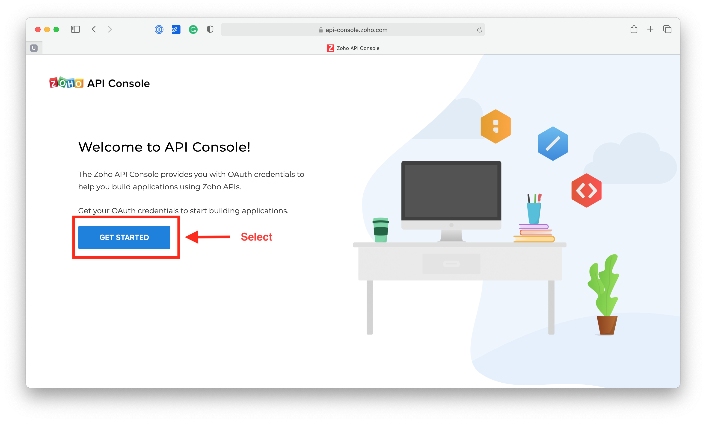
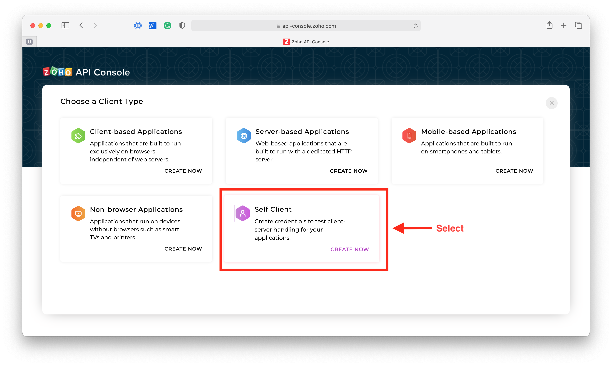
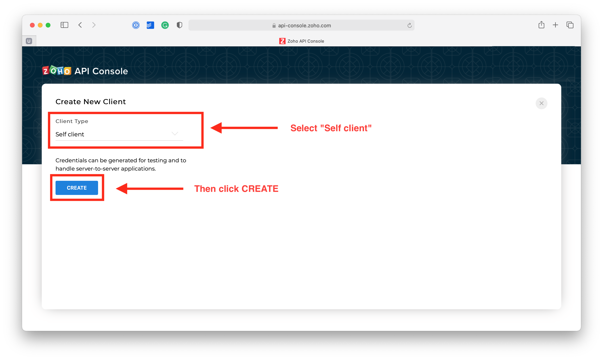
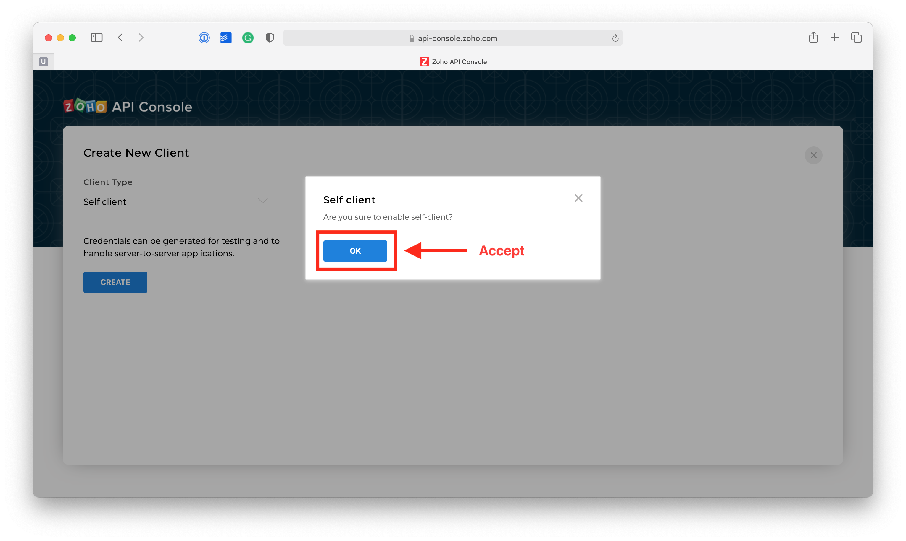
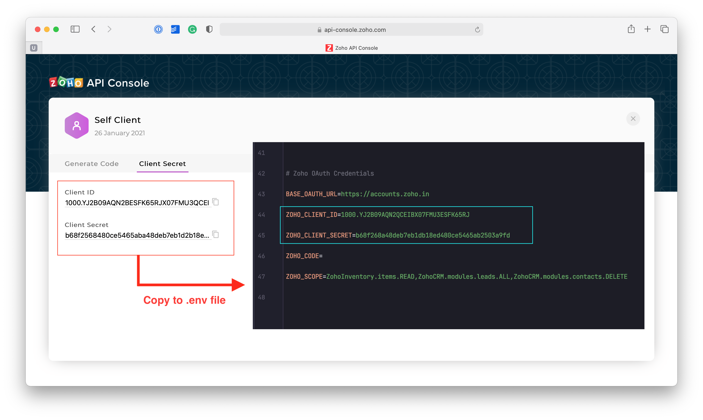
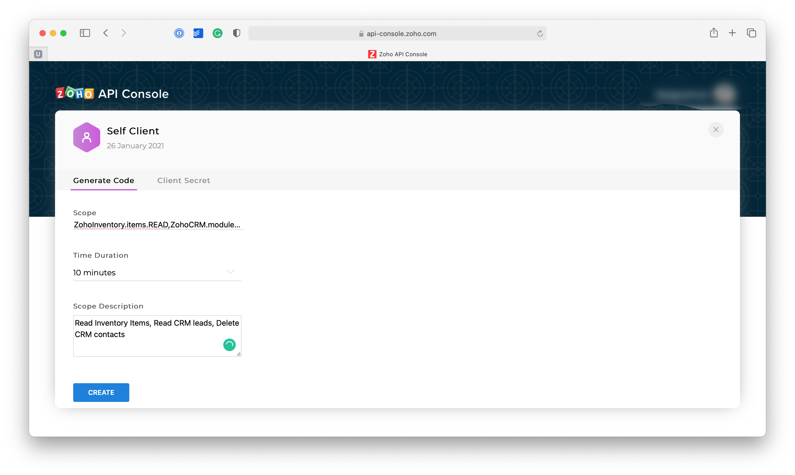
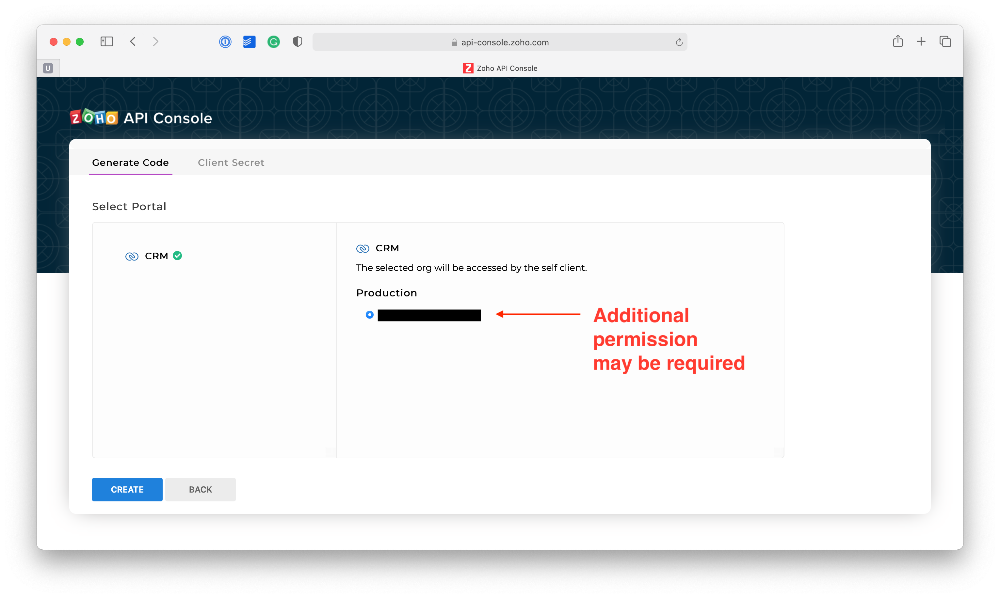
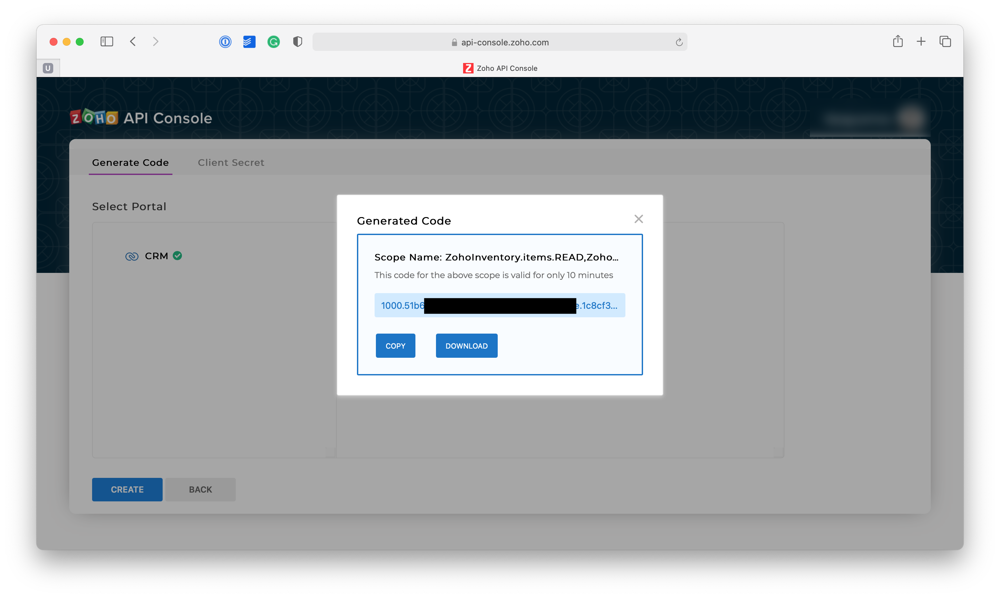

[Back to Main Page](/laravel-zoho-oauth/)

## Creating Zoho OAuth Credentials

Follow these instruction to create `Client ID`,`Client Secret` and `Zoho Authorization Code`

1. **Step 1 of 8** [Log in to Zoho Developer Console](https://accounts.zoho.com/developerconsole)
   
2. **Step 2 of 8** Create a client type
   
3. **Step 3 of 8** Create a new **Self Client**
   
4. **Step 4 of 8** Confirm
   
5. **Step 5 of 8** Copy the client ID and client secret to your laravel `.env`
   
6. **Step 6 of 8** Add

   - [ ]  **Scope separated by a comma**

     <details>
             <summary>Zoho Inventory Scope</summary>


     | Scope    | Value                         | Description |
     | -------- | ----------------------------- | ----------- |
     | Contacts | ZohoInventory.contacts.CREATE |             |
     |          | ZohoInventory.contacts.UPDATE |             |
     |          | ZohoInventory.contacts.READ   |             |
     |          | ZohoInventory.contacts.DELETE |             |
     | Items    | ZohoInventory.items.CREATE    |             |
     |          | ZohoInventory.items.UPDATE    |             |
     |          | ZohoInventory.items.READ      |             |
     |          | ZohoInventory.items.DELETE    |             |


     </details>
   - [ ]  **Duration:** The generated code will expire after the duration which you select. Once expired, you have to generate a new one.
   - [ ]  **Description:** Describe your scope



7. **Step 7 of 8** Select additional permissions (where applicable)
   
8. **Step 8 of 8** Copy the code
   
9. By the end of process your `.env` should have variable like this


```dotenv
# Zoho OAuth Credentials
BASE_OAUTH_URL=https://accounts.zoho.in/
ZOHO_CLIENT_ID=
ZOHO_CLIENT_SECRET=
ZOHO_CODE=
ZOHO_SCOPE=ZohoInventory.items.READ,ZohoCRM.modules.leads.ALL,ZohoCRM.modules.contacts.DELETE
```

[Back to Main Page](/)
